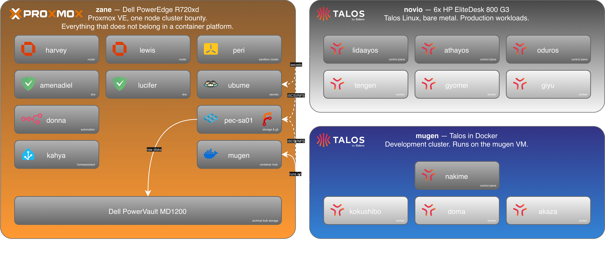

# Homelab

I run a Kubernetes homelab to host the services I use every day, on six bare metal nodes and a single Dell PowerEdge hypervisor. This repository is the design behind it: the network, the storage, the virtualisation, the clusters, the secrets and the backups, plus the reasoning behind every choice.

**At a glance**

- Talos Linux on the bare metal nodes, split into three control planes and three workers
- One Proxmox host for the things that do not belong in a container platform
- GitOps as the starting point, so the repository is the source of truth and the cluster follows
- The services I actually use every day, from photo backup to document management

This repository is also part of my portfolio. A running cluster only shows the result. This shows the thinking that led to it: the trade-offs I weighed, the measurements I based decisions on, and the things I deliberately chose not to build.

The lab exists to keep my professional skills sharp and to give me a place where I own, and have to think about, the whole stack rather than just the part I specialise in during the day. Running real services for myself forces me to think about maintenance windows, security, backup, deployment strategy and automation, and it teaches me what is actually worth documenting.

This README is the general overview. Everything specific lives in the subdirectories.

---

## Design principles

- **No circular dependencies in the recovery path.** Forgejo runs on TrueNAS rather than in Kubernetes, so restoring the cluster does not require the cluster.
- **Nothing the cluster depends on runs inside it.** Network, DNS, storage and secrets sit outside Kubernetes and have to keep working when Kubernetes does not. The same rule applies further down the stack: TrueNAS cannot live on storage it serves.
- **Redundancy here buys maintenance windows, not hardware fault tolerance.** Two OPNsense instances and two DNS servers exist so I can patch one at a time. The hardware behind them is not redundant, and physical resilience is deliberately out of scope: this lab reproduces production practice at the operating system and Kubernetes layer, not at the facility layer, since it still has to fit at home.
- **The design tolerates one node at a time.** etcd quorum and Ceph replication are sized so that a single Talos node of each type can crash, reboot or be patched without losing the cluster. That is the failure I plan for, because it is the one that actually happens.
- **GitOps, including the parts no controller watches.** Git holds the intent for everything: the IP plan, Talos machine configs, Kubernetes manifests, playbooks. The workloads are reconciled continuously because they change every week, while a DHCP reservation gets typed in by hand from the plan that decided it. The test is not whether a controller applied it, but whether I could rebuild it from the repository alone.
- **Measure before optimising.** Storage, power draw and placement decisions were made on measurements, not assumptions.

---

## Repositories

Four repositories, each with one purpose. All primarily hosted on my own Forgejo. Where
something is published, a clone is pushed outward rather than the other way around.

| Repository | Visibility | Contains |
| --- | --- | --- |
| **homelab** (this one) | Public | Infrastructure design, IP plans, diagrams, backup tiers, Talos config patches. |
| [**flux**](https://github.com/TEQ-cloud/flux) | Public | GitOps monorepo for Novio and Mugen. Charts and manifests per app, one values file per cluster. |
| [**peri**](https://github.com/TEQ-cloud/peri) | Public (GitHub primary) | The GitOps repo for my single node demo cluster, kept separate so guides can be followed along with. |
| **vault** | Private | Kubeconfigs, talosconfigs, cluster secrets. What a fresh laptop needs. |

The Flux repository is deliberately public and holds nothing sensitive: every secret it
references is pulled from OpenBao at runtime.

---

## Hardware

| Device | Role |
| --- | --- |
| Dell PowerEdge R720xd (`zane`) | Single node Proxmox VE cluster (`bounty`). |
| Dell PowerVault MD1200 | Disk shelf, archival bulk storage. |
| 6x HP EliteDesk 800 G3 DM | Bare metal Kubernetes nodes (Novio). |
| Cisco Catalyst | Core switch. |

The lab previously ran a two node Proxmox cluster, and a two node VMware vSAN cluster before that. The R730xd was retired when its workloads moved to containers on bare metal Kubernetes, driven by power draw: it idled above 220W at roughly 5% CPU, more than the entire six node cluster draws under load. I simply did not need that capacity.

See [`virtualization/`](virtualization/README.md) and [`kubernetes/`](kubernetes/README.md) for the details and for which workloads live where. The services themselves are declared in the flux repository.

---

## Kubernetes clusters

| Cluster | Platform | Purpose |
| --- | --- | --- |
| [**novio**](kubernetes/novio/README.md) | Talos, bare metal, 6 nodes | Simulated production cluster. Everything I actually depend on. |
| [**mugen**](kubernetes/mugen/README.md) | Talos in containers on a dedicated virtual machine, one routable IP per node | Development. Tests Cilium, CSI, RBAC and rollouts against real Talos before they reach Novio. |
| [**peri**](kubernetes/peri/README.md) | k3s, single node VM | Demos, guides and tutorials. |

---

## Directory structure

| Path | Contents |
| --- | --- |
| [`network/`](network/README.md) | VLANs, IP plan, firewall policy, border routers. |
| [`storage/`](storage/README.md) | TrueNAS, pool layout, storage tiering, democratic-csi, Ceph. |
| [`virtualization/`](virtualization/README.md) | Proxmox host and guests. |
| [`kubernetes/`](kubernetes/README.me) | Shared cluster decisions, then one directory per cluster. |
| [`secrets/`](secrets/README.md) | OpenBao, key layering, what lives where. No secrets. |
| [`backup/`](backup/README.md) | Backup tiers and the backout plan. |
| [`diagrams/`](diagrams/README.md) | Network and infrastructure diagrams. |

---

## Naming

Names provide structure, so I try to pick names that carry meaning but are also fun. A lot of the names in this lab come from characters and places in films and series, which makes the whole thing a little more interesting to work on.

The scheme itself encodes the architecture. Clusters are named after places or things that carry something. Control planes get proper names because they are singular and deliberate, while workers are named after characters who are out in the field, because that is where the work happens. Seeing which kind of name shows up in an alert tells you the role before you look anything up.

---

## About me

I am a Linux and Kubernetes engineer from the Netherlands, and I run TEQcloud, where I Manage Kubernetes clusters for others. I self-host as much as I can, because I want to own the systems my data lives on. When a provider changes its terms, my options are to accept them or to leave, and on hardware I do not control I cannot verify that those terms are kept anyway. That same motivation is why I started [iTEQ](https://github.com/TEQ-cloud/iteq), a self-hosted end to end encrypted chat platform.

I write about this work as I go. Posts about specific parts of the lab are linked from the section they belong to.

- [**Portfolio**](https://quintendehaard.com/) & [**Blog**](https://quintendehaard.com/blog)
- [**Knowledge base**](https://kb.teqcloud.net)
- [**LinkedIn**](https://www.linkedin.com/in/quinten-de-haard-2b4900333/)
- [**Company site**](https://teqcloud.net) & [**Company LinkedIn**](https://www.linkedin.com/company/teqcloud)